# Caption/Animation Renderer – Init Context

## 🎯 핵심 개념

* **정규화 좌표**: 스테이지(Stage = 영상 콘텐츠 박스) 기준 (0\~1)
* **절대 시간**: 모든 단어/에셋은 `absStart` \~ `absEnd`로 활성화
* **트랙(Track)**: 역할별 레이어/스타일 프리셋

  * subtitle: 하단 자막, 세이프에어리어·폰트 기본값
  * free: 스티커/효과 등 자유 배치
* **큐(Cue)**: 시간·루트 그룹 단위, 자식 요소 포함
* **레이어 우선순위**: `track.layer > cue.zIndex > element.zIndex`
* **포털/Breakout**: 특정 요소만 그룹 클립을 무시하고 상위 레이어로 탈출
* **타임라인 계약**: 플러그인은 상대 Timeline만 구성, 동기화는 렌더러가 담당
* **동적 로딩**: ES Dynamic Import + Blob URL (fetch+hash 검증 후 import)
* **무결성 검증**: SHA-384 해시, 선택적으로 ed25519 서명
* **샌드박스**: 플러그인은 컨테이너 DOM 안에서만 동작, Portal API로만 탈출 가능
* **싱크 기준**: 전부 `mediaTime` (requestVideoFrameCallback 사용)
* **프리롤**: `preloadMs` 전에 DOM/폰트/에셋 준비
* **폴백**: 자산 미로드 시 기본 효과로 graceful degrade

---

## 📑 명령파일 JSON 스펙 (요약)

```ts
{
  version: "1.3",
  timebase: { unit: "seconds", fps?: number },
  stage: { baseAspect: "16:9" },
  tracks: Track[],
  cues: Cue[]
}
```

* **Track**: `id, type(subtitle|free), layer, overlapPolicy, defaultStyle`
* **Cue**: `id, track, hintTime, root(GroupNode)`
* **Node**: group | text(absStart, absEnd) | image | video
* **Layout**: position(0\~1), size, transform, overflow, override
* **EffectScope**: breakout { mode, toLayer, coordSpace, return }

---

## 📦 플러그인 패키지 구조

```
plugins/
  glitch@2.1.0/
    manifest.json
    index.mjs
    assets/
      sprite.png
      font.woff2
```

### manifest.json 예시

```json
{
  "name": "glitch",
  "version": "2.1.0",
  "entry": "index.mjs",
  "integrity": {
    "entry": "sha384-...",
    "assets": { "assets/sprite.png": "sha384-..." }
  },
  "peer": { "gsap": "^3.12.0" },
  "minRenderer": "1.3.0",
  "capabilities": ["text","portal-breakout"],
  "preload": ["assets/font.woff2"],
  "schema": {
    "intensity": { "type":"number","default":1,"min":0,"max":5 }
  }
}
```

---

## 🔧 플러그인 인터페이스

```js
export default {
  name: "pluginName",
  version: "1.0.0",
  init(element, options, ctx) {},
  animate(element, options, ctx, duration) {
    const tl = gsap.timeline();
    tl.to(element, { opacity:1, duration });
    return tl; // 반드시 상대 Timeline 반환
  },
  cleanup(element) {},
  schema: {}
};
```

* ctx = { gsap, container, assets\:getUrl, portal, onSeek, timeScale, ... }

---

## 🔒 보안/로딩 규칙

1. manifest.json fetch → 해시/서명 검증
2. preload 자산 fetch(+검증)
3. entry fetch & 검증 → Blob URL → import
4. validate: name/version/minRenderer
5. sandbox context 주입 (컨테이너 DOM 제한)
6. 캐싱 (memory + localStorage)
7. 실패 시 기본 애니메이션 폴백

---

## ⏱ 싱크 처리 규칙

* **마스터 클락**: video.mediaTime (requestVideoFrameCallback)
* **활성 조건**: absStart ≤ mediaTime < absEnd
* **진행도 계산**:
  `progress = (mediaTime - absStart)/duration`
  `tl.pause().progress(progress)`
* **프리롤**: subtitle=250ms, sticker=150ms
* **graceMs**: 100\~150ms (자산 늦을 때 폴백)
* **시킹**: 즉시 mount 후 progress jump
* **배속**: progress 기반 강제 → 드리프트 없음

---

## 📈 플러그인 로딩 시퀀스 다이어그램

```mermaid
sequenceDiagram
    participant Renderer
    participant Loader
    participant S3 as S3/CloudFront
    participant Plugin as Plugin Code

    Renderer->>Loader: 특정 플러그인 필요
    Loader->>S3: manifest.json 요청
    S3-->>Loader: manifest.json 응답
    Loader->>Loader: 해시/서명 검증
    Loader->>S3: preload 자산 fetch
    S3-->>Loader: 자산 응답(+검증)
    Loader->>S3: entry(index.mjs) fetch
    S3-->>Loader: entry 코드
    Loader->>Loader: 해시 검증 → Blob URL 생성
    Loader->>Plugin: dynamic import(entry)
    Plugin-->>Loader: init / animate / cleanup 함수
    Loader->>Renderer: sandbox context 주입 + Timeline 반환
    Renderer->>Renderer: 재생/정지/시킹 동기화 관리
```



---

## ✅ 개선 포인트 요약

* 동적 로딩 + 캐싱: 유지
* 무결성 검증: import 전에 반드시 fetch+hash
* DOM 전역 접근 금지 → 컨테이너 샌드박싱 + Portal API
* 타임라인 소유권: 플러그인은 상대 Timeline만 반환
* 패키지화: S3 버전 디렉토리 + manifest.json 필수
* 스키마 확장: 편집기 UI 자동화/국제화 지원
* 에셋 싱크: GIF 지양, 스프라이트/Lottie/비디오 추천