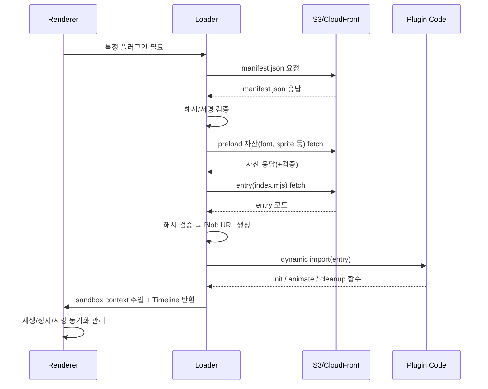

# 플러그인 시스템 아키텍처 (v2 설계)

동적 로딩, 무결성 검증, 에셋 관리, 샌드박싱을 지원하는 확장 가능한 플러그인 아키텍처

---

## **🎯 핵심 개념**

- **동적 로딩**: ES Dynamic Import + Blob URL 기반 안전 로딩
- **무결성 검증**: SHA-384 해시 검증 + 선택적 서명 검증
- **샌드박스**: 플러그인은 컨테이너 DOM 안에서만 동작, 권한(capabilities) 기반 Portal API 제공
- **타임라인 계약**: 플러그인은 반드시 상대 시간(0~duration)만 정의 → 렌더러가 재생/정지/시킹 제어
- **패키지화**: 플러그인은 S3 버전 디렉토리로 배포 (manifest.json + index.mjs + assets/)
- **프리로딩**: manifest.json에 preload 힌트 → 폰트/스프라이트 선로딩
- **캐싱**: 메모리 + 로컬스토리지 + 버전 기반 immutable 캐시
- **플러그인 체인(pluginChain)**: 하나의 요소에 여러 플러그인을 순차/중첩 적용. 각 플러그인은 독립 파라미터를 가짐.
- **상대 타이밍 윈도우**: 각 플러그인은 요소의 `absStart/absEnd`에 대해 `relStart/relEnd`(초) 또는 `relStartPct/relEndPct`(0..1)로 자체 실행 구간을 정의.

---

## **📦 플러그인 패키지 구조 (S3)**

```bash
plugins/
  glitch@2.1.0/
    manifest.json
    index.mjs
    assets/
      sprite.png
      effect.gif
      font.woff2
```

### **manifest.json 예시**

---

## **🔧 플러그인 인터페이스**

```jsx
export default {
  name: "pluginName",
  version: "1.0.0",
  init(element, options, ctx) {
    // 초기 상태
  },
  animate(element, options, ctx, duration) {
    // 반드시 0~duration 범위 Timeline 반환
    const tl = gsap.timeline();
    tl.to(element, { opacity: 1, duration });
    return tl;
  },
  cleanup(element) {
    // 정리
  },
  schema: { /* 파라미터 정의 */ }
};
```

- **ctx**: { gsap, container, assets:getUrl, portal, timeScale, onSeek, … }
- **animate() 반환값**: GSAP Timeline (상대시간만 사용)

### **PluginSpec (런타임 스키마)**

```ts
type PluginSpec = {
  name: string                   // 플러그인 식별자
  params?: Record<string, any>   // 개별 플러그인 파라미터
  // 상대 시간 윈도우: 요소의 absStart/absEnd에 대한 오프셋
  // relStart는 absStart에 더해지고, relEnd는 absEnd에 더해진다(초 단위).
  // 퍼센트 기반도 선택 지원: relStartPct/relEndPct (0..1, 요소 구간 길이 D=absEnd-absStart에 비례)
  relStart?: number              // seconds offset from absStart (default 0)
  relEnd?: number                // seconds offset from absEnd   (default 0)
  relStartPct?: number           // 0..1, (absStart + D*relStartPct)
  relEndPct?: number             // 0..1, (absEnd   + D*relEndPct)
}

// 하나의 노드에 여러 플러그인을 적용하려면:
type PluginChain = PluginSpec[]  // pluginChain: PluginSpec[]
```

렌더러는 각 플러그인 p에 대해 실제 실행 창(window)을 다음과 같이 계산한다:
- `D = absEnd - absStart`
- `t0 = absStart + (p.relStart ?? D*(p.relStartPct ?? 0))`
- `t1 = absEnd   + (p.relEnd   ?? D*(p.relEndPct   ?? 0))`
해당 구간에서만 플러그인 효과를 적용한다.

---

## **🔒 무결성 & 보안**

- **해시 검증**: manifest.json에서 entry/asset 해시 확인 후 Blob import
- **서명 검증**: ed25519 공개키로 검증(선택)
- **샌드박스 규칙**
    - 기본: 컨테이너 DOM 안에서만 조작 가능
    - capabilities.portal-breakout: 허용된 경우 Portal API 제공
    - breakout 전송 방식: 기본은 **transfer:"move"**(원본 노드 재부모화). 필요 시 **"clone"**으로 복제 후 연출 가능.
- **CORS & CSP**
    - S3/CloudFront: Access-Control-Allow-Origin:*, immutable 캐싱
    - 호스트 앱 CSP: script-src에 blob: 허용 필요

---

## **🗂 로더(PluginLoader) 책임**



1. manifest.json fetch → 해시/서명 검증
2. preload 자산 fetch(+검증)
3. entry fetch & 검증 → Blob URL → import
4. validate: name/version/minRenderer
5. sandbox context 주입
6. 캐싱: 메모리/LRU/로컬스토리지
7. 실패 시: 폴백 또는 기본 애니메이션

---

## **⚡ 최적화 전략**

- **프리로딩**: preload 자산만 먼저 로딩
- **선택적 로딩**: 실제 cue에서 사용된 플러그인만 로딩
- **백그라운드 Prefetch**: 우선순위 낮은 플러그인 점진 로드
- **캐싱**: 버전별 immutable 캐싱, LRU로 메모리 관리
- **자산 최적화**: GIF 대신 스프라이트/애니메이션 SVG 권장, 폰트는 FontFace preload

---

## **📝 파라미터 스키마 확장**

- **유효성**: min/max, enum, dependency
- **UI 메타**: control(slider/select/color), step, unit
- **툴팁/i18n 라벨**: 다국어 지원
- **에디터 자동화**: 스키마 기반으로 UI 자동 생성

---

## **🚀 런타임 계약**

- **mount(props, ctx) → Timeline**
- **update(props) (선택)**
- **dispose()**
- **onSeek(progress) (선택)**
- **getPreloadAssets(props) (선택)**
- (대안) 타임라인 없이 **seek 함수형** 제공을 허용: `apply(progress, el, ctx)` 형태로 렌더러가 매 프레임 호출해 구동.

---

### **타임라인 운용 요약(GSAP)**
- 마스터 클락: video `mediaTime`(requestVideoFrameCallback 우선).
- 각 요소 전체 길이 `D`와 pluginChain의 각 창(window) 기준으로 **마스터 타임라인 하나**를 구성.
- 플러그인은 타이머를 직접 구동하지 않고 **상대 Timeline(0~1)** 을 반환(또는 seek 함수형).
- 렌더러가 매 프레임 `progress`를 mediaTime으로 강제 주행. 배속/시킹/프레임드랍에도 드리프트 없음.
- 속성 충돌은 래퍼 레이어 분리 또는 CSS 변수 합성으로 방지.

---

## **📑 개선 포인트 요약**

- ✅ 동적 로딩 + 캐싱: 유지
- ✅ 폴백 & 디그레이드: 유지
- ❌ 무결성 검증 → import 전에 fetch+hash 검증으로 보완
- ❌ DOM 전역 접근 → 컨테이너 샌드박싱 + Portal API
- ❌ 타임라인 소유권 불명확 → animate는 상대 Timeline 반환 규약
- ✅ 패키지/매니페스트/버전 관리 → S3 버전 디렉토리 + manifest.json 필수
- ✅ 스키마 확장 → 편집기 UI 자동화/국제화 지원

---

```json
{
  "name": "glitch",
  "version": "2.1.0",
  "entry": "index.mjs",
  "integrity": {
    "entry": "sha384-...",
    "assets": {
      "assets/sprite.png": "sha384-...",
      "assets/font.woff2": "sha384-..."
    },
    "signature": "base64(ed25519_signature)"
  },
  "peer": { "gsap": "^3.12.0" },

  // Peer Dependencies 설명:
  // 플러그인이 직접 설치하지 않고, 호스트(렌더러)에서 제공받는 라이브러리
  // → 중복 설치 방지, 버전 충돌 해결, 번들 크기 최적화
  "minRenderer": "1.3.0",
  "capabilities": ["text", "portal-breakout"],
  "preload": ["assets/font.woff2", "assets/sprite.png"],
  "schema": {
    "intensity": { "type": "number", "default": 1, "min": 0, "max": 5, "ui": { "control": "slider" } },
    "colorShift": { "type": "boolean", "default": true }
  },
  "i18n": {
    "ko": { "description": "사이버펑크 글리치 효과" },
    "en": { "description": "Cyberpunk-style glitch text effect" }
  }
}
```